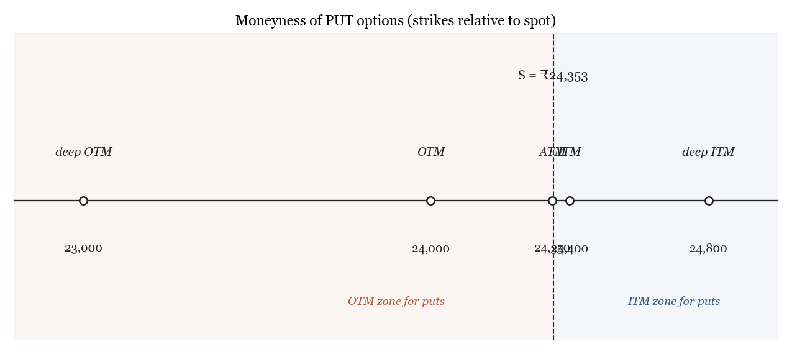
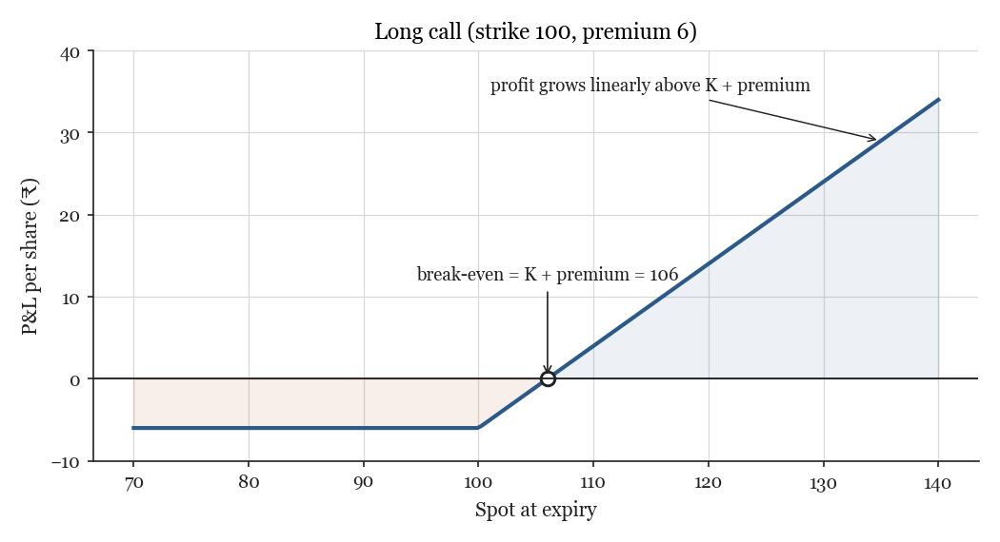
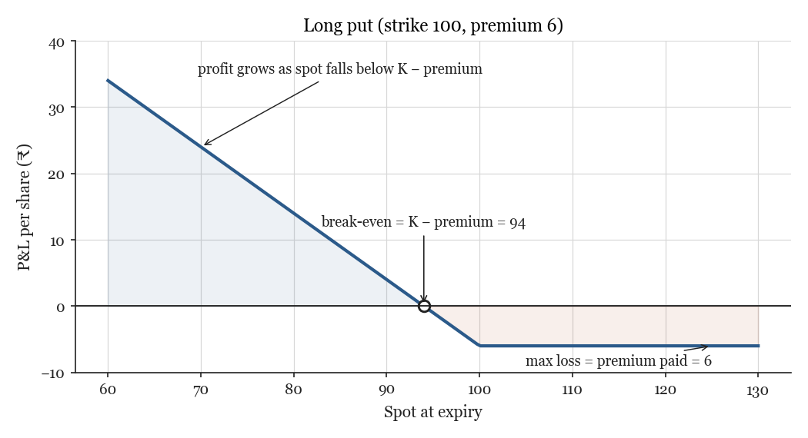
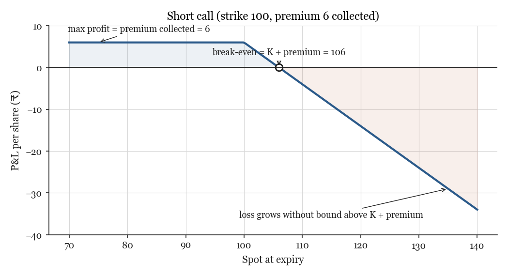
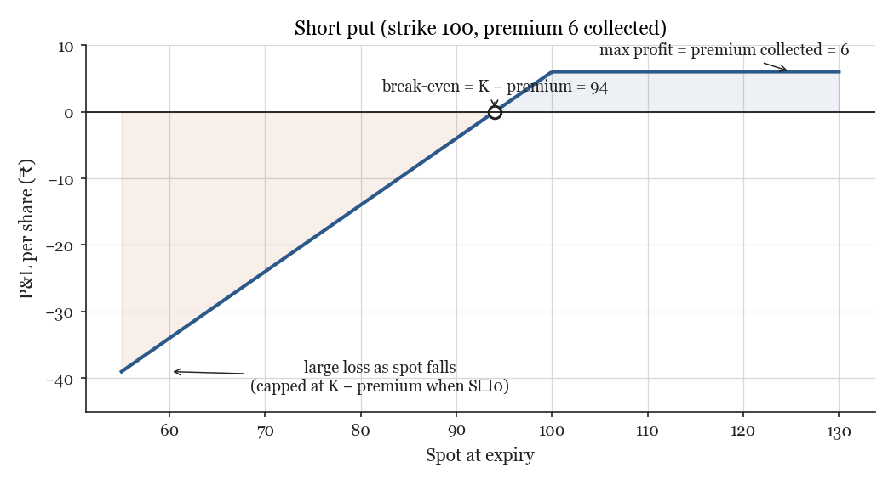
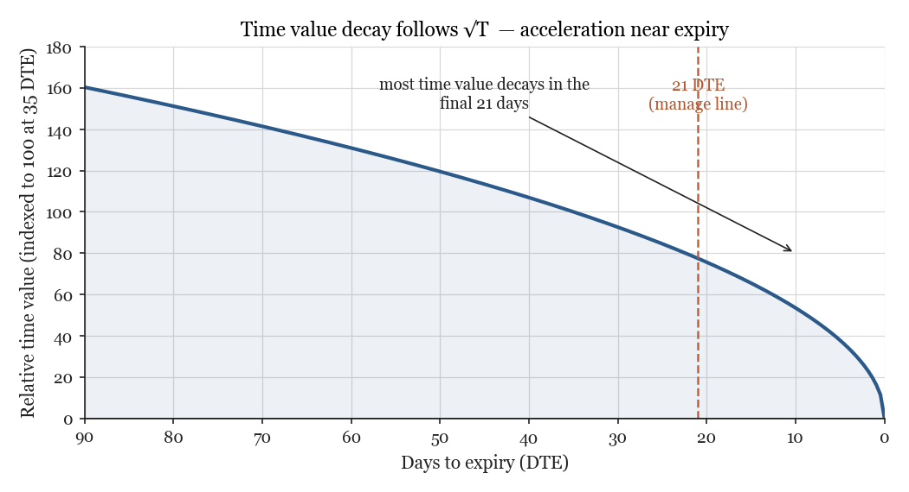
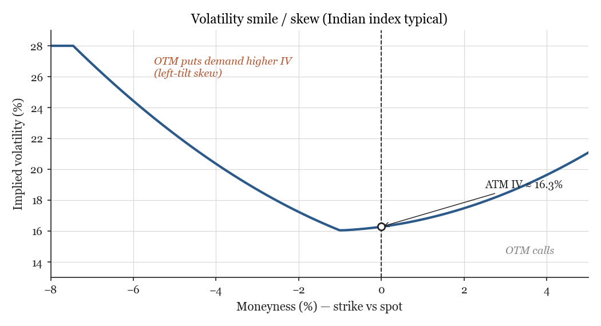
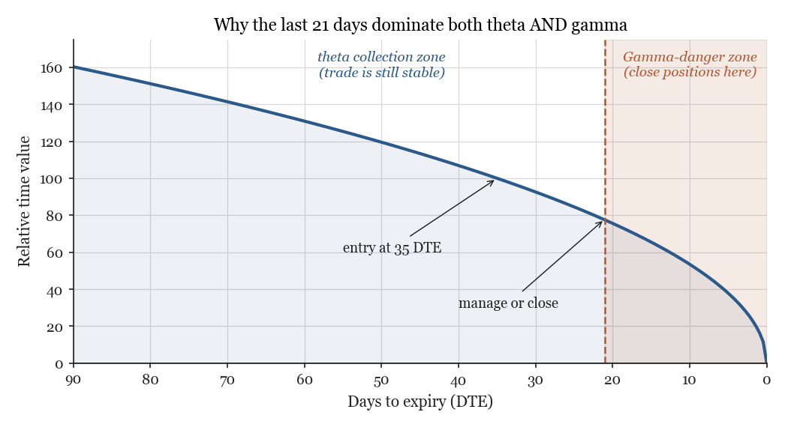
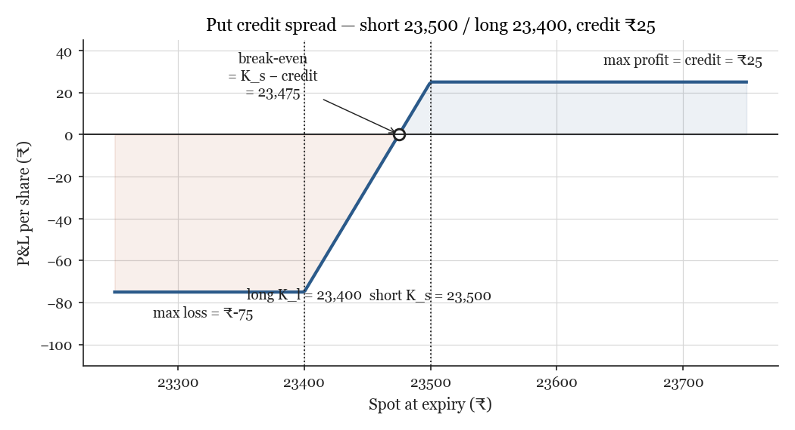

# Options & Credit Spreads — A Hardcore Reading Manual

*A 3-hour, self-contained study text for a retail trader who wants to understand
NIFTY put credit spreads from first principles. Every term that appears in the
practice problems is defined in the chapters before it. Worked answer key at
the very end.*

---

## How to use this book

Read in order. The chapters are deliberately layered: each one introduces only
what the next one needs. If a sentence feels dense, slow down — most of the
density is intentional and the next paragraph almost always unpacks it.

The first eleven chapters build the **vocabulary and intuition**. Chapters 12 to
17 apply that vocabulary to the actual job: picking, sizing, managing, and
timing put credit spreads. Chapter 18 is **fifty practice problems** organised
by theme. Chapter 19 is the **fully worked answer key** — try a problem first,
then check.

Three guideposts you will see repeatedly:

> **Intuition first.** What is the trader actually doing? What would a sensible
> human believe before any math?

> **Then the formula.** Math is a precision instrument. It refines intuition;
> it does not replace it.

> **Then the trap.** Where does this concept mislead a beginner? What is the
> first-order error?

The body uses INR (₹) and Indian-market lot sizes throughout, even in
abstract drills, so the muscle memory you build is the right one for NFO trading.

A note on notation: `S` is spot price; `K` is strike price; `T` is time to
expiry expressed in **years** (so 35 days = 35/365 ≈ 0.0959 years); `σ` is
volatility expressed as a decimal (so 18% IV = 0.18); `r` is the risk-free
rate (we use 6.5% for India in 2026); `q` is the dividend yield of the index
(≈ 1.4% for NIFTY).

---

## Roadmap

```
   What an option IS  ──►  Moneyness (ATM/OTM/ITM)  ──►  Payoff diagrams
                                                               │
                                                               ▼
                  Lognormal model & √T scaling   ──►   Implied vol (IV)
                                                               │
                                       Realized vol (RV)  ◄────┤
                                              │                ▼
                                              ▼          IV Rank / Percentile
                                          IV − RV gap   ◄──────┤
                                              │                │
                                              ▼                │
                  Delta  ──►  Theta, Gamma, Vega   ◄───────────┤
                                              │                │
                                              ▼                │
                  Spreads (anatomy)  ──►  Put credit spread    │
                                              │                │
                                              ▼                │
                  Strike selection (delta-targeted)            │
                                              │                │
                                              ▼                │
                              Probability of profit (POP)      │
                                              │                │
                              SPAN + Exposure margin           │
                                              │                │
                              Trade management (manage@21)     │
                                              │                │
                                              ▼                │
                     Regime grading: when to trade  ◄──────────┘
```

Each box pulls from the boxes behind it. The terminal idea — *regime grading* —
ties everything together.

---

## Chapter 1 — What an option actually is

An **option** is a contract between two people. One person — the **buyer** — pays
the other a small fee today, and in exchange receives the *right* (but not the
obligation) to do something in the future at a price fixed today. The other
person — the **seller**, also called the **writer** — collects that small fee
upfront, and in exchange agrees to honour whatever the buyer chooses.

The "something" can be either:

- **Buy** the underlying instrument at a fixed price (a **call option**), or
- **Sell** the underlying instrument at a fixed price (a **put option**).

The "fixed price" is called the **strike price** (`K`). The "future date" is the
**expiry** (or **expiration**). The "small fee" is the **premium**. The
"underlying instrument" is whatever the option is based on — for our purposes
it will almost always be **NIFTY 50** (the broadest Indian large-cap stock
index) or **BANK NIFTY** (the Indian banking-sector index).

### The insurance analogy

The cleanest physical analogy is house insurance. You pay an insurance company
a yearly premium today. In return, *if* your house burns down within the year,
the company pays you the rebuild cost. If your house does not burn down — which
is most of the time — the company keeps the premium and you got nothing
tangible, only peace of mind.

Now flip the picture. You are the insurance company. You collected the premium.
You do not want the house to burn down. Each day that passes without a fire,
some of the premium "becomes yours" (the policy has less life left to it). At
the end of the policy term, if no fire occurred, the premium is fully yours.
That is exactly how an option seller experiences a put option: they collect
premium upfront, and if the underlying (the "house") behaves itself, the
premium decays into their pocket day by day.

The option **buyer** is buying insurance (or a directional bet); the option
**seller** is selling insurance (or taking the other side of someone's bet).

### The four basic positions

Combining {call, put} with {buy, sell} gives four positions every options
trader memorises within the first week:

| Position           | Right or obligation                                                   | When you make money              |
|--------------------|-----------------------------------------------------------------------|----------------------------------|
| Long call (buy)    | *Right* to buy the underlying at K                                    | Underlying rises sharply         |
| Long put (buy)     | *Right* to sell the underlying at K                                   | Underlying falls sharply         |
| Short call (sell)  | *Obligation* to sell the underlying at K if buyer exercises           | Underlying stays below K, or falls |
| Short put (sell)   | *Obligation* to buy the underlying at K if buyer exercises            | Underlying stays above K, or rises |

Notice the symmetry. For every long position there is a short on the other
side. Premium flows from the long to the short at trade open; intrinsic value
(if any) flows back the other way at expiry.

### Premium, strike, expiry — the three coordinates

To uniquely identify any option, you need three numbers (and one type label).
A NIFTY option might be quoted as:

```
NIFTY 24,000 PE expiring 26-May-2026 trading at ₹225
```

That tells you everything:

- **Underlying**: NIFTY 50
- **Strike**: 24,000
- **Type**: PE = "Put European" (more on European in a moment)
- **Expiry**: 26 May 2026
- **Premium per share**: ₹225

If you bought one **lot** of this contract, you would pay ₹225 × the lot size.
For NIFTY in 2026, the lot size is **65 shares-equivalent**. So one lot of
this put costs you ₹225 × 65 = **₹14,625** upfront (plus brokerage and STT —
small frictions we will treat carefully later).

A **lot** in Indian options is the minimum tradeable quantity. You cannot
trade fractional lots. NIFTY = 65, BANKNIFTY = 35, FINNIFTY = 60. These lot
sizes change occasionally as SEBI (the regulator) recalibrates contract values
to keep margin requirements predictable.

### European vs American exercise

Some options can be exercised any time before expiry (**American**); others
can only be exercised *at* expiry (**European**). All Indian index options —
NIFTY, BANKNIFTY, FINNIFTY — are **European**. This matters: it means you do
not have to worry about the option being assigned to you in the middle of a
trade. Stock options on NSE are *European too* in practice, despite some older
documentation calling them American — assignment only happens at expiry.

For a European option, the only thing that matters at expiry is **where the
underlying closed**. Not what it touched intraday. Not what it did the day
before. Just the settlement price on expiry day.

### Cash settlement

Indian index options are **cash-settled**: at expiry, the broker computes
your profit or loss in rupees and credits/debits your account. You never
actually buy or sell NIFTY. (You couldn't anyway — you can't deliver "NIFTY
50" the way you can deliver Reliance shares.)

Stock options on NSE used to be cash-settled, then switched to **physical
delivery** in 2018 to discourage speculation. If you are short a stock option
and it expires ITM, you may have to deliver actual shares. We avoid stock
options in this manual.

### Reflection prompts

1. If you sell a NIFTY 24,000 put for ₹225 with NIFTY at 24,300, what does the
   buyer of that put gain the right to do? What's your obligation?
2. What is the smallest position you can take on NIFTY options today, in
   rupee terms, given the lot size of 65?
3. Why does it matter for risk management that NIFTY options are European, not
   American?

---

## Chapter 2 — Strikes and moneyness (ATM, OTM, ITM)

Three labels — **ATM**, **OTM**, **ITM** — describe an option's strike relative
to the current spot price of the underlying. Memorise these because almost
every conversation about options uses them as shorthand.

### Definitions

- **ATM** = "at the money": strike ≈ spot. Conventionally the strike closest
  to spot. If NIFTY is at 24,353 and the available strikes are spaced 50
  rupees apart (NIFTY's standard strike step), the ATM strike is **24,350**.
- **OTM** = "out of the money": exercising the option right now would give
  you less than zero value, so you wouldn't.
  - For a **call**: strike *above* spot. (Buying at K when you could buy at
    a lower S in the open market is foolish.) E.g., NIFTY 24,500 call when
    spot is 24,353.
  - For a **put**: strike *below* spot. (Selling at K when you could sell at
    a higher S is foolish.) E.g., NIFTY 24,000 put when spot is 24,353.
- **ITM** = "in the money": exercising right now would give you positive
  value.
  - For a call: strike below spot.
  - For a put: strike above spot.

The mnemonic: **calls and puts are mirror images.** A call wants spot above
strike; a put wants spot below strike. ATM is the same idea for both — strike
sitting on top of spot.

### Intrinsic value and time value

An option's premium can always be split into two pieces:

- **Intrinsic value** = the immediate exercise value, floored at zero.
  - For a call: max(S − K, 0).
  - For a put: max(K − S, 0).
- **Time value** = premium − intrinsic value. Always ≥ 0.

OTM options have **zero intrinsic value** — the option is "underwater". Their
premium is *all* time value. This is why deep-OTM premiums collapse to zero
as expiry approaches: there is nothing left but time value, and time value
inevitably decays to zero on the day of expiry.

ITM options have positive intrinsic value. As expiry nears, the time-value
component shrinks toward zero, and the option's price converges to its
intrinsic value alone. At the bell on expiry day, the option is worth exactly
its intrinsic value.

ATM options sit at the maximum-time-value point: the highest "uncertainty
premium" in the chain, because at-the-money is where the market is most
unsure whether the option will finish in or out of the money.

### Worked example

NIFTY spot is **₹24,353**. Strike step is 50.

| Strike | Type | Quoted ₹ | Intrinsic | Time value | Moneyness |
|--------|------|---------:|----------:|-----------:|-----------|
| 24,350 | PE   | 261.7    | 0         | 261.7      | ATM       |
| 24,000 | PE   | 143.0    | 0         | 143.0      | OTM       |
| 23,500 | PE   | 59.0     | 0         | 59.0       | OTM       |
| 24,400 | PE   | 287.0    | 47.0      | 240.0      | ITM       |
| 24,800 | PE   | 540.0    | 447.0     | 93.0       | deep ITM  |

Notice that as you go deeper ITM, intrinsic value rises and time value falls.
At 24,800 the option is mostly intrinsic — the market is barely paying a time
premium on something that is "already worth" 447 rupees of exercise value.

### The moneyness chart

Imagine the strike axis horizontal, centred on spot:



For **puts**, ITM is on the right (high strikes) and OTM on the left (low
strikes). For **calls**, swap the labels. Spot sits in the middle either way,
and ATM is the strike closest to spot.

### Why deep-OTM premium decays the fastest

Time value for an OTM option depends on the probability that spot will move
*through* the strike before expiry. As expiry approaches, that probability
shrinks (less time = less chance of a big move), so time value shrinks. For
deep OTM, the probability was small to begin with and shrinks toward zero
faster — the percentage decay per day is severe.

This is exactly why **selling deep-OTM puts** is a popular premium-collection
trade: you collect a small fee per share, the option is unlikely to be
exercised, and time value bleeds in your favour day after day. The catch is
that "unlikely" is not "impossible," and the loss when it does go wrong can
dwarf many cycles of small wins. We will return to this trade-off when we
discuss spreads.

### Reflection prompts

1. NIFTY at 24,353. Is the 24,300 PE ITM, ATM, or OTM? What is its intrinsic
   value?
2. If a NIFTY 24,500 PE is quoted at ₹185 with spot 24,353, what is the time
   value of the option?
3. Which option will lose value faster as expiry approaches: a 24,350 PE
   (ATM) or a 23,500 PE (deep OTM), all else equal? Justify.

---

## Chapter 3 — Option payoffs at expiry

Every option's economic outcome at expiry can be drawn as a **hockey stick**
on a graph of P&L (vertical axis) versus underlying price at expiry
(horizontal axis). There are only four shapes — long call, long put, short
call, short put — and every multi-leg structure is just a sum of these four.

We use one consistent convention: the diagram shows P&L *per share*, and the
underlying price at expiry is on the x-axis. Multiply by lot size to get
per-contract rupees.

### Long call (you bought a call)

You paid premium `c` upfront. You profit if spot at expiry exceeds the strike
by more than the premium you paid.



- **Max loss**: `c` (you paid it; that's all you can lose).
- **Max profit**: unlimited (theoretically — spot can rise without bound).
- **Break-even at expiry**: `S = K + c`.

### Long put (you bought a put)

Mirror image of the long call. You profit if spot falls below the strike by
more than the premium.



- **Max loss**: `p` (premium paid).
- **Max profit**: `K − p` (spot drops to zero — limited because spot can't
  go negative).
- **Break-even at expiry**: `S = K − p`.

### Short call (you sold a call)

You collected premium `c`. You profit if spot stays *below* the strike. You
lose unlimitedly if spot keeps rising.



- **Max profit**: `c`.
- **Max loss**: unbounded (this is why naked short calls are professional-only
  — Indian regulations require huge margin to even attempt).
- **Break-even at expiry**: `S = K + c`.

### Short put (you sold a put)

The trade we care about most. Mirror of the short call. You collected premium
`p`. You profit if spot stays *above* the strike. You lose if spot drops far
below the strike, but the loss is bounded — because spot cannot go below zero.



- **Max profit**: `p` (premium collected).
- **Max loss**: `K − p` (cap because spot ≥ 0). For NIFTY at K = 24,000, that
  cap is 24,000 − premium ≈ ₹23,800 per share. Times a 65-lot, that's ~₹15
  lakh per lot — a number large enough to wipe out a retail account on one
  bad day.
- **Break-even at expiry**: `S = K − p`.

This last point — **catastrophic naked-put losses** — is precisely why we
build spreads. By buying a cheaper farther-OTM put alongside our short put,
we cap the downside at a known small number. Chapters 11–12 cover this.

### Why "at expiry"?

These payoff diagrams describe the trade's settled outcome. Before expiry,
the option's *price* is more complicated: it has time value, and it responds
to spot moves, IV shifts, and the calendar. The hockey stick is the
**terminal** state. We will spend several chapters on the *intermediate*
state.

### Reflection prompts

1. You sell a NIFTY 24,000 put for ₹150 (one lot of 65). At expiry NIFTY
   closes at 23,800. What is your P&L per lot?
2. Same trade, but NIFTY closes at 24,300. P&L per lot?
3. At what spot price at expiry do you exactly break even on the trade above?

---

## Chapter 4 — Probability and the lognormal model (intuition only)

You cannot price an option without an opinion about the future of the
underlying. The market's opinion is encoded as a **probability distribution**
over where spot might be at expiry. The standard model assumes that
*returns* (not prices) are normally distributed, which makes *prices*
**lognormally** distributed.

You don't need to do calculus to use this. You need three intuitions.

### Intuition 1 — Returns, not prices

Markets compound. A 10% gain followed by a 10% loss does not return you to
flat — it leaves you 1% down. So when we model "movement," the natural
mathematical object is the **continuously compounded return**:

```
r = ln(S_tomorrow / S_today)
```

Add up daily `r` values and you get the period return. The arithmetic is clean
and, importantly, the values are roughly normally distributed if the
underlying is "typical" — meaning they form a bell curve.

### Intuition 2 — Prices ride a lognormal

Because returns are normal, prices are *lognormal*. Lognormal distributions
look skewed: the right tail is fatter than the left, because a stock can in
principle go to infinity but cannot go below zero. This asymmetry is why
"fair value" of an option is not just the average of payoffs at expiry — you
have to weight by the lognormal density.

You will not compute lognormal densities in this manual. You will, however,
need one consequence:

> A 1-σ move over T years is approximately `±S × σ × √T`.

That formula is **the** workhorse of intraday option intuition.

### Intuition 3 — The √T scaling rule

If the annualised volatility is `σ` (e.g., 18%), then the expected
1-standard-deviation move over `T` years is:

```
move = S × σ × √T
```

Why √T and not T? Because variance is linear in time (independent daily
moves accumulate), but standard deviation is the *square root* of variance.
A 4× longer holding period means **2× larger** typical move, not 4× larger.

#### Worked example

NIFTY at 24,000. ATM IV is 18% (annualised). Expiry is 36 calendar days
away — `T = 36/365 ≈ 0.0986` years.

```
1σ move = 24,000 × 0.18 × √0.0986
        = 24,000 × 0.18 × 0.314
        ≈ 24,000 × 0.0566
        ≈ ₹1,358
```

So the market is pricing a 1-σ move of about ±₹1,358 over the next 36 days.
At ±2σ that's ±₹2,716. By the normal-distribution rule, spot has roughly:

- 68% probability of finishing within ±1σ of where it is now
- 95% probability of finishing within ±2σ
- 99.7% probability of finishing within ±3σ

(Lognormal corrects this slightly — the right tail is fatter — but for
near-the-money strike selection the normal approximation is fine.)

### Time decay is not linear

A direct consequence of √T: time value *does not* decay at a constant rupees-
per-day pace. It accelerates as expiry nears. Why? Because √T ≈ √(35/365) when
35 days remain, and √T ≈ √(7/365) when 7 days remain. The drop from 35 → 7
days is a factor of 5× in T, but only a factor of √5 ≈ 2.24× in σ√T, so
option value falls *faster* in those last 7 days than in the first 28 days
combined.

This is the fundamental reason **manage-at-21-DTE** rules exist. We will
formalise it under "Theta and Gamma."



### Reflection prompts

1. With NIFTY at 24,000 and ATM IV 20%, what is the 1-σ expected move over
   30 days? Over 90 days?
2. If σ doubles, by how much does the 1-σ move increase, holding T constant?
3. If T doubles, by how much does the 1-σ move increase, holding σ constant?

---

## Chapter 5 — Implied volatility (IV)

**Implied volatility** is the market's bet on σ — what value of annualised
volatility, plugged into the Black-Scholes-Merton (BSM) pricing model, would
produce the option price you actually see on the screen.

The phrase "implied" is precise: IV is *implied* by the price. It is not
observed directly. You read off the option price from the order book, you
plug everything else (S, K, T, r) into BSM, and then you ask "what σ makes
the model output equal the screen price?" That σ is IV.

### IV is a number per option

Because each strike has its own market price, each strike has its own IV.
There is no single "IV of NIFTY" — there is the IV of the 24,000 PE, the IV
of the 24,500 CE, and so on. Most of the time these IVs cluster within a few
percentage points of each other.

The label **ATM IV** refers to the IV of the strike closest to spot. It's
the most-watched IV because it is least biased by skew effects and
because it most cleanly represents the market's central expectation.

### The volatility smile and skew

Plot IV (y-axis) against strike (x-axis) for one expiry, and you usually do
*not* get a flat line. You get a U-shape called the **smile**, often tilted
to the left for equity indices, called the **skew** (because OTM puts have
higher IV than OTM calls).



For Indian indices the left side (puts) usually slopes up steeply: traders
demand more premium per unit of vega for OTM puts because crashes happen
faster than rallies. This is a permanent fact of equity option markets and
not a "pricing error" — it reflects the genuine asymmetric risk in stocks.

### How IV moves

IV is a single number summarising market expectations, and it moves on:

- **Macro shocks** — RBI surprise, geopolitical news, Fed decisions, election
  outcomes. IV can jump 30%+ in a day and decay slowly.
- **Earnings** (for stock options) — IV bids up before the print, crashes
  immediately after. The "vol crush" pattern.
- **Time** — IV tends to drift down toward realised vol when nothing
  surprising is happening (the so-called "vol mean reversion").

### India VIX

The **India VIX** is a published index that aggregates IV across the near-
month NIFTY options into one number. Think of it as "ATM IV of NIFTY with the
skew effect smoothed out, normalised to a 30-day horizon." On a quiet day it
might sit at 12-15. During panics it can spike above 30. We use India VIX as
the canonical "current vol regime" reading throughout this manual.

### Reflection prompts

1. Why can't there be a single number called "IV of NIFTY"? What is the
   convention for picking one if you must?
2. If the 24,000 PE shows IV 22% and the 24,500 CE shows IV 16%, which
   way does the smile tilt? What is the trader's interpretation?
3. India VIX is 17 today. What does that mean in plain English?

---

## Chapter 6 — Realized volatility (RV)

**Realised volatility** is the σ that actually showed up in the price series
over a recent window. Unlike IV, RV looks **backward** — it measures what
the underlying *did*, not what the market *expects* it to do.

### The formula

For a window of `n` trading days ending today:

```
1.  Compute daily log returns:    r_i = ln(S_i / S_{i-1})  for i = 1..n
2.  Compute their sample stdev:   σ_daily = sqrt( Σ(r_i − r̄)² / (n − 1) )
3.  Annualise:                    σ_annual = σ_daily × √252
```

The factor `√252` reflects the standard convention that there are ~252 trading
days per year. (NSE actually has ~245 trading days due to holidays, but √252
is the universal convention.)

### Why annualise?

Because σ is meaningless without a time scale. A "1% daily move" is a wildly
different statement from a "1% annual move." Annualising puts every vol
number on the same axis as IV (which is also annualised), so you can compare
them apples-to-apples.

### Worked example

Say NIFTY closed at the following levels over five consecutive trading days:

```
Day 0:  24,000
Day 1:  24,150
Day 2:  23,980
Day 3:  24,050
Day 4:  23,900
```

Daily log returns:

```
r_1 = ln(24150/24000) = ln(1.00625) = +0.00623
r_2 = ln(23980/24150) = ln(0.99296) = −0.00707
r_3 = ln(24050/23980) = ln(1.00292) = +0.00291
r_4 = ln(23900/24050) = ln(0.99376) = −0.00626
```

Mean: r̄ = (+0.00623 − 0.00707 + 0.00291 − 0.00626) / 4 = −0.00105

Squared deviations from mean:

```
(+0.00623 − (−0.00105))² = (+0.00728)² ≈ 5.30e-5
(−0.00707 − (−0.00105))² = (−0.00602)² ≈ 3.62e-5
(+0.00291 − (−0.00105))² = (+0.00396)² ≈ 1.57e-5
(−0.00626 − (−0.00105))² = (−0.00521)² ≈ 2.71e-5
                                    sum ≈ 13.20e-5
```

Sample variance = 13.20e-5 / (4 − 1) = 4.40e-5
Sample stdev daily = √4.40e-5 = 0.00663 = 0.663% daily.
Annualised RV = 0.00663 × √252 = 0.00663 × 15.87 = **0.1052 = 10.52%**.

(Toy example. With only 4 returns the estimate is noisy. In practice you
want ≥ 20-30 daily returns for a stable rolling RV.)

### Rolling-window RV

Since RV is sensitive to which window you pick, traders compute several:

- **RV-10d**: last 10 trading days. Reactive to recent news.
- **RV-30d**: last 30 days. Common reference window. Matches most option-
  pricing intuition for monthly cycles.
- **RV-60d / RV-90d**: longer baseline; useful for regime context.

In our regime watcher we use **RV-30d** as the comparison against IV.

### Why RV is the "truth"

A premium seller's job is to defend a position against the *actual* movement
of the underlying. IV is the price they are paid for that defence. RV is the
movement they actually have to absorb. If RV > IV, they are being underpaid
for the work — across many cycles, the math is against them.

This single observation — RV vs IV — is the most important tactical question
a premium seller can ask each week. The whole next chapter is about it.

### Reflection prompts

1. Why do we use log returns instead of percent returns for RV computation?
2. If the daily stdev of returns is 1.2%, what is the annualised RV?
3. Why do traders compute multiple rolling windows (10d, 30d, 60d) instead of
   one fixed number?

---

## Chapter 7 — IV − RV: the volatility risk premium

Pull these two chapters together: **IV is what you sold premium for; RV is
what you have to live with.** The gap between them is your **edge** (or your
disadvantage).

The number `IV − RV` is called the **volatility risk premium (VRP)**. When
positive, you're collecting more than the index is delivering. When negative,
you're collecting less.

### What VRP > 0 means

The market is paying more for protection than the underlying actually
requires. Example: NIFTY ATM IV is 22%, but the index has only realised 17%
over the last 30 days. VRP = +5pp ("five percentage points"). On a per-
cycle basis, this is the textbook setup for premium selling — you're being
paid for risk that the market is over-estimating.

Historically across global indices the **average** VRP has been roughly +2 to
+4pp. That long-run positive average is *why* premium-selling has a pulse
of profitability over decades — not a mystery, just market-clearing
overestimation of risk by a small margin.

### What VRP < 0 means

The market is paying *less* than the underlying is delivering. You are
underpaid for the actual chop. Across many cycles this is a losing trade,
even with delta and management discipline.

Example from our session: NIFTY ATM IV 17.7%, RV-30d 26.1%, VRP = −8.4pp.
That's a strongly negative regime. A single trade entered there might still
work out (probability of profit is still > 50% on a 30-delta short put),
but the *average* outcome is negative.

### Why VRP can flip sign

VRP changes when either side moves:

- **IV jumps**: macro shock, panic buying of puts, surprise news. Sudden,
  fast.
- **RV jumps**: actual chop arrives without prior warning (gap moves, intraday
  whipsaws). Lagging — RV is computed from the past.
- **Both**: large shocks usually move both, IV first (instant) and RV over
  the next few weeks as the shock propagates through daily returns.

After a sharp selloff, IV typically spikes and RV catches up over the
following 2-4 weeks. VRP often goes deeply positive *during* the selloff and
then mean-reverts as the calmer days following the shock pull RV up while IV
deflates.

### Why VRP is the single most important regime number

Unlike "VIX is high" (which doesn't account for actual chop) or "trend is up"
(which doesn't account for vol pricing), VRP directly measures **how much
the market is paying you for risk you'll actually absorb**. Every other
signal is a circumstantial helper around this central one.

### Reflection prompts

1. India VIX is 24, RV-30d is 28. What is the VRP? Is it favourable for a
   premium seller?
2. After a sharp selloff, does VRP typically go more positive or more
   negative? Why?
3. If both IV and RV are around 20%, should a disciplined premium seller
   take a credit-spread trade? Why or why not?

---

## Chapter 8 — IV Rank vs IV Percentile

Knowing IV is one number isn't enough. You also need to know "is this number
high or low *for this market*?" Two related-but-different metrics serve this:

### IV Rank

**IV Rank** measures where today's IV sits between the **highest and lowest**
IV in some lookback window (typically 52 weeks). The formula:

```
IV Rank = ( IV_today − IV_low_52w ) / ( IV_high_52w − IV_low_52w )
```

IV Rank is a number between 0 and 1 (or 0% to 100%). At 0.5, today's IV is
exactly halfway between the year's low and high. At 0.9, it's near the year's
high.

### IV Percentile

**IV Percentile** measures the **fraction of the lookback window's days** on
which IV closed at or below today's value. Formula (for a series `H` of
historical IV values):

```
IV Percentile = count( h ∈ H : h ≤ IV_today ) / |H|
```

Like IV Rank, this is a 0-1 (or 0%-100%) number. At 0.7, today's IV is
higher than 70% of all days in the lookback.

### The crucial difference

IV Rank uses **only the min and max** of the historical series. IV Percentile
uses **the full distribution**. They agree when the distribution is uniform
between min and max. They disagree — sometimes a lot — when the distribution
is skewed.

Volatility distributions are **right-skewed**: lots of low and medium days,
occasional spikes. So:

- The **max** is usually a single-day spike (a panic) that pulls the IV
  Rank's "high" anchor unusually high.
- The **min** is often a multi-day drift to a complacency-low.
- **Most days** sit closer to the median than to the extremes.

### Worked example

Suppose India VIX over the last 60 days had values mostly between 12 and 18,
but with a one-week panic spike to 28:

```
IV today:     17.2
IV low (60d): 11.4
IV high (60d): 28.0
```

- **IV Rank** = (17.2 − 11.4) / (28.0 − 11.4) = 5.8 / 16.6 = **0.349 = 34.9%**
- **IV Percentile**: if we count actual days, perhaps 40 of 60 days had IV
  ≤ 17.2, so **0.667 = 66.7%**.

Same data. IV Rank says "we're in the lower third." IV Percentile says
"we're above two-thirds of recent days." They disagree by 30+ percentage
points. Which is "right"?

For the question "is current vol unusually high or low *compared to recent
history*?", **IV Percentile is the more honest answer**, because it accounts
for the actual frequency distribution. IV Rank gets distorted by single-day
extremes that don't represent the typical regime.

That said, IV Rank is more popular in US retail (because of certain platforms
defaulting to it), and traders often quote it without realising the
distortion. Always know which one you are looking at.

### A working rule of thumb

For premium selling:

- **IV Percentile ≥ 70%** → "high enough to justify selling premium." This
  is our regime watcher's signal 2 threshold.
- IV Percentile < 30% → "options are cheap; consider buying premium or
  sitting out."

### Reflection prompts

1. Compute IV Rank and IV Percentile from this 10-day VIX series:
   `[12, 13, 12, 14, 15, 12, 13, 14, 16, 18]` with today = 14. Why do they
   differ?
2. When is IV Rank a good substitute for IV Percentile?
3. If IV Percentile = 80% but VRP is −3pp, is the regime favourable? Discuss.

---

## Chapter 9 — The Greeks, part 1: Delta

The **Greeks** are partial derivatives of an option's price with respect to
its inputs. Each Greek isolates one variable's effect, holding all others
constant. There are five worth knowing — Delta, Gamma, Theta, Vega, Rho — but
in practice retail spread traders care about the first four; Rho (interest
rate sensitivity) almost never matters.

This chapter covers **Delta**. Chapter 10 covers Theta, Gamma, and Vega.

### What Delta is

**Delta (`Δ`)** is the rate of change of an option's price with respect to
spot. Formally:

```
Δ = ∂V / ∂S
```

If an option's Delta is 0.40, then a ₹1 increase in spot increases the option's
value by ₹0.40 (approximately). Delta is dimensionless when expressed as a
fraction; it can also be quoted in "shares" (e.g., "this option is +0.40
deltas, equivalent to being long 0.40 shares").

### Sign conventions

Long calls have **positive delta** (more spot = more value).
Long puts have **negative delta** (more spot = less value).
Short calls have **negative delta** (you sold something with positive delta).
Short puts have **positive delta** (you sold something with negative delta).

You will sometimes see traders quote `|Δ|` (absolute value) to avoid sign
confusion when discussing puts. We follow that convention loosely: when we
say "a 30-delta put," we mean `|Δ| = 0.30`.

### Delta as probability proxy

A useful approximation:

> `|Δ|` ≈ probability that the option finishes ITM at expiry

A 30-delta put has roughly a 30% chance of finishing in-the-money. By
implication, a 30-delta short put has a **70% probability of finishing OTM**
— meaning it expires worthless and the seller keeps the full premium.

This approximation is **good enough for most decisions**. It is not perfect:

- It assumes the underlying follows the lognormal distribution implied by
  current IV.
- It ignores skew (OTM puts have higher IV → higher implied probability of
  the tail event).
- It ignores drift (interest rate, dividends).

For a premium seller picking strikes, |Δ| is the standard lever, and the
approximation is ingrained in the vocabulary.

### Delta as the strike-selection knob

Saying "I want to sell the 30-delta put" is more universal than saying "I
want to sell the 23,400 PE" — the former works regardless of where spot
happens to be that day, the underlying you're trading, or the DTE. It maps
your strategy to the option's *risk profile* rather than the strike's
absolute number.

In a credit-spread context:

- **Δ = 0.20** short put: ~80% probability of finishing OTM, smaller credit.
- **Δ = 0.30** short put: ~70% probability of finishing OTM, larger credit.
- **Δ = 0.50** short put: ATM, coin flip. Maximum theta but maximum gamma.

### How Delta evolves

For a short put, Δ decreases (toward zero) when:

- Spot rises (the put is moving more OTM).
- Time passes (the put has less time to go ITM).
- IV drops (the lognormal "tail" shrinks).

It increases (toward −1, fully ITM) when the opposites happen.

The rate at which Δ itself changes is **Gamma**, which is the next chapter.

### Reflection prompts

1. You are short the 23,500 PE with Δ = −0.25. Spot rises ₹100. By roughly
   how many rupees did your position's value change per share? Did you make
   or lose money?
2. A 0.20-delta put expires ITM. By the rough probability proxy, was this
   outcome surprising or expected? Quantify.
3. You want to sell premium with the highest "probability of profit." Should
   you sell a 0.10-delta put or a 0.40-delta put?

---

## Chapter 10 — The Greeks, part 2: Theta, Gamma, Vega

Three more Greeks complete the picture for spread traders.

### Theta

**Theta (`Θ`)** is the rate of change of an option's value with respect to
the passage of one day, holding everything else constant.

```
Θ = ∂V / ∂t   (note: t is time TO expiry; passage of time means t shrinks)
```

For an option **buyer**, Θ is *negative*: every day, the option loses some
time value. For an option **seller**, Θ is conceptually *positive* in the
sense that the seller's position gains value (the option they sold is worth
less to buy back).

We say "theta is your daily wage" when you're a premium seller. A 0.30-delta
short put might have Θ = −2 per share for the buyer, meaning the seller's
P&L improves by ₹2 per share per day if spot doesn't move. That's ₹130 per
lot per day (₹2 × 65). Over 35 days that's ₹4,550 of theoretical theta-burn,
which roughly equals the premium you collected.

But — and this is essential — Θ is not constant.

### Theta acceleration

Because of the √T scaling rule (Chapter 4), time value does not bleed in a
straight line. It bleeds slowly when there's a lot of time left, then
accelerates sharply in the final few weeks:



The curve is roughly proportional to √T. From 35 DTE to 21 DTE, time value
falls from 100% to 78% (since √(21/35) ≈ 0.78). From 21 DTE to 0, it falls
from 78% to 0% — the entire 78%! — in the last three weeks. That's why **the
last 21 days carry both the biggest theta gift and the biggest gamma risk**.

### Gamma

**Gamma (`Γ`)** is the rate of change of Delta with respect to spot. It's
"Delta's delta."

```
Γ = ∂Δ / ∂S = ∂²V / ∂S²
```

Gamma matters because it tells you how *unstable* your delta exposure is. A
high-gamma position can flip from "comfortable 30-delta short" to "panicked
80-delta short" overnight on a 1% spot move. Low-gamma positions are
"stable" — a 1% spot move barely changes your delta.

Gamma is largest for **ATM options near expiry**. It's smallest for deep
OTM/ITM options far from expiry.

Practical implication: a short put credit spread has roughly *neutral* gamma
when both legs are equidistant from spot (because the short and long
contributions partially cancel). But if spot drifts toward the short strike,
gamma at the short leg explodes while the long leg's gamma stays small —
the spread becomes highly unstable.

This is the **gamma blow-up zone**. It's why we close trades at 21 DTE
rather than holding through expiry.

### Vega

**Vega (`ν`)** is the rate of change of the option's value with respect to
implied volatility:

```
ν = ∂V / ∂σ      (per 1 percentage point of IV change)
```

A long option has positive Vega (rising IV makes the option more valuable).
A short option has negative Vega (rising IV makes the option more expensive
to buy back, which is bad for the seller).

A put credit spread has *net negative Vega* — the short leg has more vega
than the long leg, because vega scales with the option's price and the short
strike (closer to spot) is always the more expensive leg. So if IV spikes,
the spread's net price *increases* and your unrealized P&L gets worse.

This is why a sudden VIX surge during a held credit-spread trade hurts twice:
once through delta (spot probably moved against you to cause the IV spike),
and once through vega (the spread reprices wider). Both work in the same
direction.

### Net Greeks of a spread

Always think in terms of the *net* Greeks, not each leg separately. For a
put credit spread short K1 / long K2 (with K1 > K2):

- **Net Δ**: small positive. The short put has bigger |Δ| than the long, and
  short put has positive Δ exposure for the trader. The long put offsets
  some, but not all.
- **Net Θ**: positive (you're a net premium seller).
- **Net Γ**: small positive in absolute terms; the legs partially offset.
  But concentrates near the short strike.
- **Net ν**: small negative. Short leg has bigger vega than long leg.

These small numbers can become big numbers in stressed conditions. That's
the whole point of careful management.

### Reflection prompts

1. You are short a put with Θ = −3 (per share, expressed from buyer's
   perspective). Holding everything else constant, what is your P&L per lot
   (lot 65) after one day?
2. Why is gamma highest for ATM options near expiry?
3. IV jumps 2 percentage points overnight on your put credit spread. The
   short leg has vega 6, the long leg has vega 4. What is the rough impact
   on your per-lot P&L (lot 65)?

---

## Chapter 11 — Spreads: the anatomy of a multi-leg position

A **spread** is a combination of two or more option positions traded as one
unit. For our purposes a spread always has exactly two legs, both on the
same underlying and same expiry, both either calls or both puts.

### Why combine legs at all?

Two reasons:

1. **Cap the risk.** A naked short option has unbounded loss (or huge bounded
   loss for a put). Adding a long leg in the same direction puts a cap on
   the worst case. The spread is the cheap way to convert "infinite tail" to
   "known tail."
2. **Reduce the margin.** Indian brokers compute margin based on worst-case
   scenarios. A spread's worst case is much smaller than a naked option's,
   so the margin is much smaller, and your capital efficiency is much better.

The trade-off: you give up some premium. The cost of the long leg eats into
the credit you collect. But for retail-sized accounts the trade is heavily in
favour of spreads — you cannot afford the margin or the tail risk of naked
positions.

### Short leg vs long leg

In any spread, one leg is **short** (sold, premium collected) and the other
is **long** (bought, premium paid). The terms describe your position in each
leg, not which strike is higher or lower.

For a **put credit spread (bull put spread)**:

- The **short leg** is at the *higher* strike (the one closer to spot).
- The **long leg** is at the *lower* strike (further OTM).
- The short leg dominates the trade economically — bigger premium, bigger
  delta, bigger theta, bigger vega.
- The long leg is the *insurance*. It rarely matters until disaster strikes.

For a **call credit spread (bear call spread)**, the picture is mirrored:
short the lower strike (closer to spot), long the higher strike (further OTM).

### Credit vs debit

A **credit spread** is one where the short leg's premium is greater than the
long leg's premium, so you receive net cash at trade open. The bull put
spread above is a credit spread. So is the bear call spread.

A **debit spread** is the reverse — you pay net cash at trade open. Examples:
bull call spread (long lower-strike call + short higher-strike call) and
bear put spread (long higher-strike put + short lower-strike put). These are
*directional bets* with capped loss/profit.

For premium-income strategies — our entire focus — we trade **credit
spreads**. Specifically, **put credit spreads** when we expect the
underlying to *not crash*.

### Vertical, horizontal, diagonal

A **vertical spread** has both legs at the same expiry but different strikes.
Everything we discuss is vertical.

A **horizontal spread** (calendar spread) has both legs at the same strike
but different expiries. Different beast.

A **diagonal spread** has both different strikes and different expiries.
Used by advanced traders. Out of scope.

### Reflection prompts

1. Why does adding a long leg to a naked short put dramatically reduce
   margin?
2. In a put credit spread, which leg has the bigger Greeks (delta, theta,
   vega) — the short or the long? Why?
3. Distinguish credit from debit spreads. Which kind do premium-income
   traders prefer?

---

## Chapter 12 — Put credit spreads in detail

This is the trade. Master this chapter and you have most of the operational
knowledge needed to execute the strategy.

### Construction

A **put credit spread** consists of:

- **SHORT one** put at strike K_s (the higher strike, closer to spot)
- **LONG one** put at strike K_l (the lower strike, further OTM)
- Both same underlying, same expiry, same lot size.

Define:

- **width** `w = K_s − K_l`
- **net credit** `C = premium_short − premium_long`
- **max profit per share** = `C` (both legs expire worthless)
- **max loss per share** = `w − C`
- **break-even at expiry** = `K_s − C`

These five numbers fully characterise the trade's terminal economics.

### Worked example

Spot NIFTY = ₹24,000. Sell 23,500 PE @ ₹120, buy 23,400 PE @ ₹95.

```
K_s = 23,500   premium_short = 120
K_l = 23,400   premium_long  =  95
w   = 100
C   = 120 − 95 = 25 per share

max profit per share = 25
max loss  per share  = 100 − 25 = 75
break-even at expiry = 23,500 − 25 = 23,475
```

For one lot of 65:

```
max profit per lot = 25 × 65 = ₹1,625  (collected upfront)
max loss  per lot  = 75 × 65 = ₹4,875  (your capital at risk in worst case)
```

### The full payoff diagram

Here is the spread's hockey stick:



Three regions:

1. **S ≥ K_s = 23,500** at expiry → both puts expire worthless → keep full
   credit `C = 25`.
2. **K_l ≤ S < K_s** at expiry → short put is ITM, long put is OTM → loss
   is `(K_s − S) − C` per share. At S = 23,475 that's exactly zero
   (break-even).
3. **S < K_l = 23,400** at expiry → both puts are ITM, but the long put
   protects you fully → loss is capped at `w − C = 75` per share.

### The credit-to-width ratio

A useful single number for comparing different spread structures:

```
credit-to-width = C / w
```

For our example: 25 / 100 = 0.25 or 25%.

Interpretations:

- **Higher ratio = better risk/reward**: more credit per ₹ of width risked.
- For a given delta target, ratio is roughly stable across underlyings.
- Below ~10% the trade is usually not worth taking (too much risk per ₹
  collected).
- Above ~40% you've probably gone too close to ATM (the premium is fat
  because the strike is risky).

The 25-30% range is the typical retail sweet spot.

### Why this is called a "bull put spread"

Counter-intuitive name. You are *short* puts, so you are *bullish* on the
underlying — you profit if it goes up *or stays flat*. The "bull" descriptor
is from the position's directional bias, not from the long-vs-short label.

### Comparison: credit spread vs naked put

Same NIFTY 23,500 short put, but instead of buying the 23,400 protection,
you stay naked.

| Metric                    | Credit spread (23500/23400) | Naked short 23,500 PE |
|--------------------------|-----------------------------|------------------------|
| Net premium per lot       | ₹1,625                      | ~₹7,800 (at ₹120)      |
| Max loss per lot          | ₹4,875                      | ~₹15.27 lakh           |
| Approx. SPAN+exposure BP  | ~₹7,000                     | ~₹2.3 lakh             |
| Capital efficiency        | High (BP small)             | Atrocious              |

The credit spread gives up roughly four-fifths of the premium but caps the
loss to a survivable number and reduces BP requirement by ~30×. For a ₹41k
account, this is not even a choice — naked puts on NIFTY are simply
unaffordable.

### Reflection prompts

1. Sell a 23,800 PE for ₹110, buy a 23,600 PE for ₹65. Compute width,
   credit, max profit, max loss, break-even. What is the credit-to-width
   ratio?
2. With NIFTY at 24,000, the above spread expires three weeks later with
   NIFTY closing at 23,750. Compute P&L per share and per lot.
3. Why is the strategy called "bull put spread" when it consists of being
   short a put?

---

## Chapter 13 — Strike selection by delta

Once you've committed to a spread structure, you must pick *which strikes*.
The professional answer is "by delta." This chapter explains why and shows
the trade-offs.

### The delta-targeted approach

Pick a target delta for your **short leg** — typically 0.20, 0.25, or 0.30.
Find the strike whose `|Δ|` matches that target. Then pick a long strike a
fixed width below (say 100 or 150 points). That's your spread.

The advantages of strike-by-delta:

- **Underlying-agnostic**: "30-delta put" works the same way on NIFTY,
  BANKNIFTY, RELIANCE, or US options. Strike numbers don't translate.
- **Vol-regime adaptive**: a 30-delta put is closer to spot when IV is high
  (because the lognormal tail is fatter, so a less-OTM strike has the right
  ITM probability), and farther from spot when IV is low. The probability
  profile is held constant, not the strike distance.
- **Compares across DTEs**: 30-delta at 35 DTE vs. 30-delta at 7 DTE both
  represent the same "70% probability of full credit kept" baseline.

### The credit/cushion trade-off

Higher delta on the short leg = more credit + less cushion. Concretely:

| Short Δ | Approximate POP | Approx credit/width | Approx OTM cushion |
|---------|----------------:|-------------------:|------------------:|
| 0.20    | 80%             | ~16%               | ~3-4%             |
| 0.25    | 75%             | ~22%               | ~2.5-3%           |
| 0.30    | 70%             | ~28%               | ~1.5-2%           |
| 0.40    | 60%             | ~38%               | ~0.5-1%           |

These are rough numbers; actual values depend on IV and DTE. The pattern is
consistent though: **as you move closer to ATM, you get more premium per ₹
of width but trade away cushion**.

There is no "right" delta — there's a **right delta for your risk tolerance,
your account size, and the regime**. In a high-VRP regime, lower delta
(0.20-0.25) is well-paid because IV is rich. In a low-VRP regime, you might
need to push to 0.30+ just to make the trade economically meaningful — but
the cushion you give up cuts into your survival probability.

### Why not always 0.30?

It's tempting. 0.30 has the highest credit-to-width ratio and a respectable
70% POP. The catch: the 30% of trades that go ITM tend to go *deeply* ITM
because the strike is close to spot. The losses are bigger and more frequent
in dollar terms than 0.20-delta trades, even though the win rate looks
similar.

The right discipline: **let the regime grade choose the delta**. In an A+
regime, push to 0.30 because vol is rich and theta is fat. In a B-/B
regime, stick to 0.20 if you trade at all, because the cushion is your
primary protection when expected value is marginal.

### Width matters separately

Delta picks the *short* strike. **Width** (distance to the long strike)
controls the *max loss*. Choosing a 100-pt width vs. 150-pt width vs. 250-pt
width is a separate decision.

- **Narrower width** = smaller credit, smaller max loss, smaller BP, lower
  ROI per cycle but better probability of recovering from a bad cycle.
- **Wider width** = bigger credit, bigger max loss, bigger BP, higher ROI per
  cycle but a single bad cycle can compound multiple winners' worth of
  damage.

Retail-friendly widths on NIFTY: 100-200 points.

### Reflection prompts

1. Why is the delta-targeted approach considered more universal than picking
   strikes by absolute price?
2. You're in a regime where VRP is +5pp. Should you choose Δ = 0.20 or
   Δ = 0.30 for the short leg? Why?
3. Two credit spreads, both at Δ ≈ 0.30: one is 100-wide with ₹28 credit,
   the other 150-wide with ₹40 credit. Which has better credit-to-width
   ratio? Which has bigger absolute max loss?

---

## Chapter 14 — Probability of profit (POP)

**POP** is your estimated probability of finishing the trade with non-negative
P&L. There are several ways to compute it, and each tells you something
slightly different.

### Delta-implied POP

The simplest approximation. For a short put with `|Δ_short| = 0.30`:

```
POP_delta ≈ 1 − |Δ_short| = 1 − 0.30 = 0.70 = 70%
```

This is the **probability the short strike finishes OTM at expiry** — i.e.,
the probability you keep the *full* credit. It does NOT equal the probability
you make money overall, because the trade can also be profitable in part of
the partial-loss zone (between K_s and break-even).

A more precise delta-implied POP would integrate the lognormal density from
break-even to infinity. For most retail purposes the simple `1 − |Δ|`
approximation is close enough. It's slightly *under*-estimating true
probability of profit.

### RV-implied POP

Compute POP using realised volatility instead of implied volatility:

```
1.  Compute σ_t = σ_RV × √(DTE / 365)        (RV scaled to T)
2.  Compute z = (K_s − S) / (S × σ_t)        (standard-normal z-score)
3.  POP_RV = 1 − N(z)                         (where N is the standard CDF)
```

Why bother? Because IV and RV often disagree, and the disagreement matters.
If IV < RV, the delta number — which is computed from IV — *under*-estimates
the probability of ITM relative to what realised vol would predict. POP_RV
is the more honest answer if you believe the recent past will repeat.

### Worked example

NIFTY spot 24,353, short strike 23,900, DTE = 36, RV-30d = 26.1%, IV = 17.7%.

```
σ_t (using RV)  = 0.261 × √(36/365) = 0.261 × 0.314 = 0.0820
z              = (23,900 − 24,353) / (24,353 × 0.0820) = −453 / 1996 = −0.227
POP_RV         = 1 − N(−0.227) = 1 − 0.410 = 0.590 = 59%

Compare to delta-POP at Δ = 0.30 → POP_delta = 0.70 = 70%.

Gap: POP_delta − POP_RV = 11pp.
```

The market is pricing 70% POP through delta, but realised vol says 59% is
more honest. That 11pp gap is the IV-RV discrepancy expressed in probability
terms. It tells the trader: **the market is under-pricing the chop, so your
real probability of full profit is lower than the delta number suggests.**

### When the two POPs agree

When VRP ≈ 0 (IV ≈ RV), POP_delta ≈ POP_RV. The disagreement *is* the
volatility risk premium expressed in probability units. If you remember
nothing else from this chapter: when these two numbers diverge by more than
~5pp, take the lower one as your operational estimate.

### POP is not the whole story

A high POP does not mean a profitable strategy. A 95% POP trade with a max
loss of 10× the average win is still negative-EV. **Always pair POP with
the credit-to-max-loss ratio** to evaluate a trade's expected value.

For a put credit spread:

```
EV per share ≈ POP × C  −  (1 − POP) × max_loss
```

This is a *crude* EV — it assumes the only outcomes are full credit or full
max loss, ignoring partial losses. A more careful integration weights the
intermediate partial-loss region, but the crude version is enough for a
sanity check. If the crude EV is negative, the careful version usually is too.

### Reflection prompts

1. Compute delta-POP for a short put with |Δ| = 0.18. With |Δ| = 0.45.
2. NIFTY 24,000, short K = 23,500, DTE = 30, RV-30d = 22%. Compute POP_RV.
3. A trade has POP = 75%, credit = ₹40, max loss = ₹160 (per share). What is
   the crude EV per share? Is the trade attractive?

---

## Chapter 15 — Margin: SPAN + Exposure (Indian-broker reality)

Margin is the cash a broker holds against your positions to cover potential
adverse moves. For naked options, it is huge. For spreads, it is much
smaller. Understanding the calculation matters for capital planning.

Indian brokers compute margin as the sum of two components: **SPAN** and
**Exposure**.

### SPAN margin

**SPAN** stands for "Standard Portfolio Analysis of Risk." It is a global
methodology developed by CME Group and used by exchanges worldwide,
including NSE.

SPAN looks at your positions and simulates what would happen under a
**16-scenario grid** of (spot move, IV move) shocks. The biggest projected
loss across all 16 scenarios is your SPAN margin.

For a short option, the worst-case scenario typically combines a sharp adverse
spot move with a sharp IV spike. SPAN captures both at once.

For a credit *spread*, SPAN's worst case is much smaller because the long
leg caps the loss. But it's not just `max_loss` — SPAN also accounts for IV
shocks that could temporarily widen the spread before expiry, even if the
final settlement is bounded.

### Exposure margin

**Exposure margin** is an additional buffer NSE imposes on top of SPAN —
typically 2-3% of the contract notional value. It's a regulatory cushion to
account for risks SPAN doesn't fully model (e.g., gap risk on the next
trading day).

Total broker margin = SPAN + Exposure.

### Why short options carry SPAN ≫ max-loss

For naked short options, the SPAN scenarios can push losses well beyond
"max-loss in the worst-case spot move at expiry" — because between now and
expiry, the option's price can do all sorts of things. A short option with a
"max loss at expiry" of ₹15 lakh might require ₹2-3 lakh of SPAN margin to
hold today, because the worst-case mark-to-market swing in the interim could
be that large.

### Why spreads dramatically reduce SPAN

For a spread, SPAN sees that even in the worst scenario, the long leg caps
the maximum loss. So SPAN margin tends to be ~1.0-1.5× the trade's
contractual max loss, not the wild multiple seen for naked positions.

For our v1 backtester, we used the heuristic:

```
BP ≈ 1.5 × max_loss × lot_size
```

For a NIFTY 100-wide spread with max_loss ₹71/sh, that's:

```
BP ≈ 1.5 × 71 × 65 = ₹6,923
```

This is a reasonable approximation for narrow spreads at moderate delta. It
under-estimates real BP slightly when:

- Width is wide (200+ points) — SPAN's gap-risk addons grow.
- Short delta is high (0.40+) — closer to ATM means more gamma, more SPAN.
- IV is volatile — SPAN's IV-shock leg gets bigger.

For a careful trader, **always check the broker's margin calculator** for
your specific spread before sizing. The 1.5× heuristic gets you in the
right neighbourhood for backtest math but is not a replacement for the
exchange's true number.

### Margin and ROI

Once you know BP, you can compute return on capital per cycle:

```
ROI per cycle = credit / BP
```

For our 100-wide example with credit ₹28.80/sh:

```
credit per lot = 28.80 × 65 = ₹1,872
BP per lot     = 6,923
ROI per cycle  = 1872 / 6923 = 0.270 = 27.0%
```

If you successfully closed at this profit (held to expiry, full credit kept,
no max-loss event), you'd realise 27% on the BP. A single such cycle is
~36 days. If you could repeat without losses, that would annualise to:

```
annual ≈ (1 + 0.27)^(365/36) − 1 = (1.27)^10.14 − 1 ≈ 938%
```

That number is fictional because (a) you cannot string ten in a row without
a loss, (b) margin and credit shift with regime, and (c) cycles you "miss"
because the regime is bad don't earn anything. The realistic number after
adjusting for losses, frictions, and missed cycles is much closer to 25-50%
annualised — which is still excellent if it sustains, but a far cry from
938%.

### Reflection prompts

1. What two components add up to the total broker margin in India?
2. Why is naked-short-option margin so much larger than spread margin?
3. A spread has max loss ₹65/sh and lot size 35. Estimate the BP using the
   1.5× heuristic. If credit collected per lot is ₹1,400, what is the ROI
   per cycle?

---

## Chapter 16 — Trade management

A trade is half-built when entered. The other half is the **management plan**:
when do you take profit? when do you cut losses? when do you exit because
time has run out? Without a plan, the natural human instincts (hope on
losers, take profit too early on winners) destroy strategy expectancy.

### The three exit triggers

There are exactly three reasons to close a credit spread before expiry:

1. **Profit-take**: spread shrinks to a target buy-back price (e.g., 50% of
   original credit kept).
2. **Stop-loss**: spread expands to an unacceptable level (e.g., 2× original
   credit). Many systematic premium sellers DO NOT use stops because they
   compound losses already incurred. We discuss this nuance below.
3. **Time-stop / manage-at-DTE**: spread is still open at a chosen DTE
   threshold (typically 21). Close regardless of P&L.

Plus, of course, "let it expire" — but that's not really a management decision,
just the absence of one.

### Profit-take at 50%

Sell a credit spread for ₹30. As theta and any favourable spot move work in
your favour, the spread's mid price drifts down. When it reaches ₹15
(half of the original credit), you close. You've captured 50% of the
theoretical max profit, in a fraction of the time, and you free the BP for
the next trade.

Why 50%? Because the **rate** at which you collect theta is fastest in the
first half of the trade's life. The marginal theta from holding from 50%
captured to 100% captured (i.e., the last bit of decay) is small relative
to the gamma risk you accept by holding through expiry. **Close winners
fast** is the universal premium-seller mantra.

### Manage at 21 DTE

If the trade hasn't reached profit-take by 21 DTE, **close it anyway**. The
gamma-blow-up zone (Chapter 10) means the last 21 days carry the same theta
benefit as the entire first month, but with several times the gamma risk.
Most systematic traders find that **manage@21** dominates "hold to expiry"
on risk-adjusted return — even though hold-to-expiry has higher *raw* return
when the trade works.

### The hold-to-expiry trap on narrow spreads

Specifically for narrow spreads (100-150 wide on NIFTY): one max-loss event
can destroy 6-10 winning cycles' worth of profits. Because the win rate is
high (≥ 80%), it feels like "just let it expire — odds are huge it'll
finish OTM." But the asymmetry is brutal:

- Win: keep ₹25-30 per share (typical).
- Lose: lose ₹70-75 per share (max).

With even a 90% win rate, the math:

```
EV per cycle ≈ 0.90 × 27.5 − 0.10 × 72.5 = 24.75 − 7.25 = +17.5  (positive)
```

But if win rate drops to 80%:

```
EV per cycle ≈ 0.80 × 27.5 − 0.20 × 72.5 = 22.0 − 14.5 = +7.5    (still positive but thin)
```

At 75% win rate the EV is roughly zero. Realistic NIFTY win rates depend on
the regime — and in B- regimes (the current state of our session), they
drift down toward 70-75%. **Manage@21 lifts win rate** by closing trades
that haven't yet failed but are most exposed to the gamma window — it
catches "marginal losers" before they become "max losers."

In our backtest, NIFTY managed@21 had a 94% win rate vs hold-to-expiry's
82%. The 12pp improvement in win rate, combined with smaller loss sizes
on the rare losers, tilted average per-cycle EV from −3.7% (hold) to +7.8%
(managed).

### Stop-loss in credit spreads

Most professional premium sellers DO NOT use a fixed stop-loss like "close
at 2× credit." Reason: by the time the spread doubles, you have already
absorbed most of the path that could have led to a max loss; closing now
realises that bad mark-to-market without giving the trade a chance to
recover by expiry.

The alternative — **roll** the trade. Roll means closing the current spread
and opening a new one at lower strikes (further OTM) and/or a later expiry.
A skilful roller can often turn a losing position into a small winner over
one or two extra cycles. We do not cover rolling in this manual.

For systematic-rule clarity in our backtest we used **manage@21 + 50%
profit-take, no stop-loss**. The implicit "stop" is the manage line.

### Reflection prompts

1. Why is "hold to expiry" worse on narrow credit spreads than on wide ones?
2. You sold a spread for ₹30 credit. Three weeks later the mid is ₹15.
   What action do you take, and why?
3. Why do most professional premium sellers avoid hard stop-losses?

---

## Chapter 17 — Regime grading: when premium selling actually pays

Premium-selling is not equally profitable in every market environment. The
edge comes from a confluence of conditions — and grading those conditions
is the difference between a 25% annualised system and a -10% one.

This chapter formalises the four conditions we use throughout the manual.

### The four signals

| # | Signal                               | Threshold for "favourable"     |
|---|--------------------------------------|--------------------------------|
| 1 | **VIX absolute level**               | India VIX > 22                 |
| 2 | **VIX 3-month percentile** (Chapter 8) | ≥ 70th percentile             |
| 3 | **VRP** = ATM IV − 30-day RV (Ch 7)  | ≥ 0 pp (ideally ≥ +3 pp)        |
| 4 | **Recent pullback**                  | Spot ≥ 2% off 10-day high      |

Each is a binary check (✅ or ❌). **A+ regime = all 4 pass.** A regime = 3 pass.
B+ = 2. B = 1. B− = 0.

### Why each signal alone is insufficient

- **VIX > 22 alone** could mean a sustained high-vol regime where IV is high
  but RV is even higher (a recipe for losing money even at high IV). Without
  signals 3 and 4, this is not an entry.
- **VIX percentile ≥ 70th alone** could be mostly noise — VIX has spent a lot
  of time in the 70th percentile of a quiet 3-month window without meaning
  anything is about to happen.
- **VRP ≥ 0 alone** doesn't say anything about absolute level — VRP can be
  +1 pp in a sleepy 12-vol market where premium is too small to be worth
  the risk.
- **Pullback alone** can mean a healthy market correction (good for entry)
  or the start of a 20% bear move (terrible for entry). Without VIX context,
  you don't know.

The **joint condition** is what matters. The signals reinforce each other:

- VIX absolute high AND VRP positive → premium is rich AND the market knows
  it's risky. Both are honest readings.
- VIX percentile high AND pullback present → recent regime change, with
  spot already off the highs (so you're not chasing). Both are
  *contextually* high.

A+ means: **fear is paying, fear is genuine relative to recent history,
your premium is overpriced relative to actual movement, and you're not
buying the top.**

### When does an A+ regime actually happen?

Historically, A+ moments are rare — perhaps 5-10% of trading days in any
given year. They cluster around macro shocks (Fed surprises, RBI policy
changes, geopolitical flares, COVID-style events). In between, the market
sits at B-/B/B+ for long stretches.

This is not a bug. It's the nature of premium selling: **edge is concentrated
in moments that look scary**. The discipline is to wait for those moments
and size up when they arrive, rather than constantly grinding small trades
in B-/B regimes where the math is marginal at best.

### Mean reversion of vol

VIX (and IV more generally) tends to **mean-revert** — high readings drift
down toward their long-run average over weeks; low readings drift up.
Practical consequences:

- After a VIX spike, the regime tends to *weaken* over the following 1-3
  weeks as IV deflates while RV catches up (often pushing VRP toward zero or
  negative).
- After a sustained low-VIX period, the next regime upgrade is usually
  abrupt — vol "wakes up" from a complacency-low rather than drifting up
  smoothly.

Implication: **A+ regimes are often short-lived** (days to a couple of
weeks). When you get one, act decisively. Don't wait for "even better"
conditions because the regime is most likely to weaken from here, not
strengthen.

### Reflection prompts

1. Could a regime score 3/4 (grade A) and still be a poor entry? Construct
   a counterexample.
2. Why is the joint A+ condition more reliable than any single signal?
3. After a VIX spike to the 90th percentile, VRP measures +6pp today. In
   2 weeks' time, what is your prior on what VRP will be doing?

---

## Vocabulary Appendix

Quick-reference glossary for terms and acronyms used in this manual.

- **ATM** — at the money. Strike ≈ spot.
- **bps** — basis points. 1 bps = 0.01% = 0.0001. Used for interest rates and
  fine percentage differences.
- **BP** — buying power. The capital your broker locks against an open
  position. SPAN + Exposure.
- **BSM** — Black-Scholes-Merton model. The standard option pricing
  framework.
- **CDF** — cumulative distribution function. `P(X ≤ x)` for a random
  variable X.
- **DTE** — days to expiry.
- **EV** — expected value. Probability-weighted average outcome.
- **FNO / NFO** — Futures and Options. NFO = the NSE F&O segment specifically.
- **IST** — Indian Standard Time. NSE market hours: 09:15–15:30 IST.
- **ITM** — in the money.
- **IV** — implied volatility (annualised, decimal or %).
- **K** — strike price (`K_s` short, `K_l` long for spread legs).
- **manage@21** — close the position at 21 DTE if not yet profit-taken.
- **max loss** — worst-case P&L per share (positive number, sign understood as loss).
- **max profit** — best-case P&L per share.
- **N(z)** — standard-normal CDF evaluated at z.
- **NIFTY** — NIFTY 50 index. Top-50 large-cap NSE stocks. Lot 65 (2026).
- **OCC** — Options Clearing Corporation (US). The standard ticker convention
  for US listed options. Format: `O:<UND><YYMMDD><C|P><STRIKE×1000>`.
- **OI** — open interest. Number of contracts currently open in that strike.
- **OTM** — out of the money.
- **POP** — probability of profit.
- **pp** — percentage points. The arithmetic difference between two
  percentages. "VIX moved from 17% to 22%" = "+5 pp." Distinct from "+29%"
  (which would be the relative change).
- **profit-take** — close a winning trade at a target buy-back price (e.g.,
  50% of original credit).
- **RV** — realised volatility (annualised, decimal or %).
- **σ** — sigma; volatility.
- **SEBI** — Securities and Exchange Board of India. The market regulator.
- **SPAN** — Standard Portfolio Analysis of Risk. The margining methodology.
- **spread** — multi-leg option position; in this manual always two legs.
- **STT** — Securities Transaction Tax. A small per-trade tax in India.
- **T** — time to expiry, in years (so 35 days = 35/365 ≈ 0.0986).
- **vega (ν)** — Greek for IV sensitivity.
- **VIX (India VIX)** — published index of NIFTY ATM IV, 30-day annualised.
- **VRP** — volatility risk premium = IV − RV.
- **width** — `K_s − K_l` for a vertical spread; the maximum possible loss
  per share equals `width − credit`.

---

## Chapter 18 — Practice Problems

Fifty problems organised by theme. Each problem can be solved with a
calculator and the formulas in the chapters above. **Difficulty markers**:
★ = warm-up; ★★ = standard; ★★★ = stretch.

Try each problem before checking the answer. The answer key is in
**Chapter 19**.

---

### Set A — Mechanics & moneyness (8 problems)

**A1 ★** Spot price of an equity index is ₹18,500. The 18,500 PE is quoted at
₹125. What is its intrinsic value? What is its time value?

**A2 ★** Spot is ₹18,500. Classify each as ATM, ITM, or OTM:
(a) 18,500 PE  (b) 18,300 PE  (c) 18,700 PE  (d) 18,500 CE  (e) 18,300 CE
(f) 18,700 CE.

**A3 ★** A call with strike 19,000 is quoted at ₹420 when spot is 19,250.
Compute intrinsic value and time value.

**A4 ★★** A put has intrinsic value ₹150 and the option is quoted at ₹150
exactly. What can you conclude about its time value? Under what condition is
this realistic?

**A5 ★★** Strike step is 100. Spot is ₹18,567. Which strikes are ATM
(closest to spot) and the next two on either side?

**A6 ★★** A put with strike ₹19,000 is trading at ₹120 with spot ₹19,180.
Is this option ITM, ATM, or OTM? What is its time value?

**A7 ★★** You can buy a 19,200 CE for ₹85 with spot at ₹19,180. If you
exercised this option *immediately* (assume European style allows it for
this question), what would you pay and what would you receive? What does
this say about whether to exercise?

**A8 ★★★** A deep-OTM put (strike 17,000, spot 19,000) has 30 DTE and
trades at ₹3.00. The option is European-style index option. Is the entire
₹3.00 intrinsic value, time value, or some combination? What is the option
worth at expiry if spot closes at 19,000?

---

### Set B — Payoffs at expiry (6 problems)

**B1 ★** You sell one lot of an 18,500 PE for ₹120. Lot size is 50. The
underlying closes at 18,600 at expiry. Compute your P&L per share and per
lot.

**B2 ★** Same as B1 but spot closes at 18,400. P&L per share and per lot?

**B3 ★** Same as B1 but spot closes at 18,200. P&L per share and per lot?

**B4 ★★** You buy one lot of a 19,000 CE for ₹95. Lot size is 75. Compute
the spot price at which you break even at expiry.

**B5 ★★** You sell a naked 18,000 PE for ₹85. Lot size is 50. Spot at
expiry collapses to ₹17,400. Compute P&L per lot. Was this trade ever
something a small retail trader should have entered? Explain why with one
sentence.

**B6 ★★★** Two traders execute the *same* contract — one buys a 19,500 CE
for ₹140, the other sells the same 19,500 CE for ₹140. At expiry spot is
19,800. Compute P&L per share for each side. What property of options does
this illustrate?

---

### Set C — Realised volatility & lognormal scaling (6 problems)

**C1 ★** Daily stdev of log returns is 1.25%. What is the annualised RV
(use √252)?

**C2 ★** Annualised σ is 18%. What is the daily σ (assuming 252 trading
days)?

**C3 ★★** Compute the 1-σ expected move over 30 days for a stock at ₹2,500
with annualised σ = 25%.

**C4 ★★** Same as C3 but over 90 days. By what factor did the 1-σ move
grow vs the 30-day move?

**C5 ★★** Five consecutive daily closes are: 18,500 → 18,650 → 18,500 →
18,720 → 18,610. Compute log returns, sample stdev, and annualised σ. Show
your work.

**C6 ★★★** Annualised σ is 20%. The market is expected to be open 240 days
this year (a few extra holidays). Should you use √252 or √240 to annualise
daily σ? What is the impact on the answer?

---

### Set D — IV Rank vs IV Percentile (5 problems)

**D1 ★** Over a 60-day window, IV ranged from a low of 12 to a high of 28.
Today's IV is 18. Compute IV Rank.

**D2 ★** Over the same 60-day window, suppose 42 of those days had IV ≤ 18.
Compute IV Percentile.

**D3 ★★** Given this 10-day IV series: `[14, 13, 15, 14, 16, 15, 17, 19, 22, 25]`,
with today's IV = 16, compute both IV Rank and IV Percentile.

**D4 ★★** In the series above, identify the day(s) on which IV Rank
*overstates* "high vol" most severely vs IV Percentile. Explain why.

**D5 ★★★** Suppose VIX spends most of the year hovering in the 11-15 zone,
with two brief spikes to 32 in March and 35 in October. Today's VIX is 16.
What rough relationship would you expect between IV Rank and IV Percentile?
Which is the more honest "is vol high?" answer?

---

### Set E — Greeks reasoning (6 problems)

**E1 ★** Identify the sign of Δ for each: long call, long put, short call,
short put.

**E2 ★** A short put has Δ = +0.30. Spot rises ₹50. Approximately how much
does the position's value change per share, and does the seller make or
lose money?

**E3 ★★** Rank these four options by gamma, highest first:
(a) ATM call, 7 DTE
(b) ATM call, 35 DTE
(c) Deep-OTM call, 7 DTE
(d) ATM call, 90 DTE.

**E4 ★★** A long ATM put has theta = −2.5 (per share, per day). What is the
theoretical P&L change per lot (lot 65) if one day passes with spot
unchanged?

**E5 ★★** A short put has vega 4.5 (per share). IV jumps from 18% to 21%.
Approximately how much does the position's value change per share, and is
the change favourable for the seller?

**E6 ★★★** A put credit spread: short K1 with vega 6, long K2 with vega 4.
What is the spread's net vega per share? If IV falls 1pp, what is the rough
P&L change per share for the spread holder?

---

### Set F — Spread construction & payoffs (8 problems)

**F1 ★** Sell a 19,000 PE for ₹140, buy a 18,800 PE for ₹85. Compute width,
net credit, max profit per share, max loss per share, and break-even.

**F2 ★** Same spread (F1). Lot size is 50. Compute max profit and max loss
per lot.

**F3 ★★** With the spread from F1, spot at expiry is ₹19,150. Compute P&L
per share. Which payoff zone are you in?

**F4 ★★** Same spread; spot at expiry is ₹18,950. Compute P&L per share.
Zone?

**F5 ★★** Same spread; spot at expiry is ₹18,750. Compute P&L per share.
Zone?

**F6 ★★** What is the credit-to-width ratio for the spread in F1?

**F7 ★★★** Construct a put credit spread on an underlying at ₹2,400 with
strike step ₹10. Pick a short strike at Δ ≈ 0.30 (~3 strikes OTM in
practice for moderate IV) and a long strike 30 points lower. Suppose short
mid is ₹14, long mid is ₹6. Compute width, credit, max loss, BE, and
credit-to-width ratio.

**F8 ★★★** A trader compares two spreads on the same underlying (S = 2,400):
- Spread A: short 2,380 PE @ ₹14, long 2,360 PE @ ₹7 (20-wide)
- Spread B: short 2,380 PE @ ₹14, long 2,330 PE @ ₹3 (50-wide)

Compute width, credit, max loss, and credit-to-width ratio for each. Which
spread offers better return on max-loss per ₹ of capital tied up? Which
exposes you to a larger absolute loss on a max-loss event?

---

### Set G — POP under delta vs RV (5 problems)

**G1 ★** Compute delta-implied POP for short puts with: (a) Δ = 0.18,
(b) Δ = 0.25, (c) Δ = 0.40.

**G2 ★★** Spot 18,000, short K = 17,500, DTE = 30, RV-30d = 22%. Compute
POP_RV. Use a normal-CDF approximation table (or `N(−0.5) ≈ 0.31`,
`N(−1) ≈ 0.16`, `N(−1.5) ≈ 0.07`, `N(−2) ≈ 0.023`).

**G3 ★★** Same scenario, short Δ = 0.20. Compute POP_delta. Compute
POP_RV − POP_delta. Interpret the gap.

**G4 ★★★** Spot 18,000, short K = 17,200, DTE = 60, RV-30d = 16%, IV at the
short strike = 22%. Compute both POP_RV and POP_IV (using IV in the
formula). Which one would a careful premium seller act on?

**G5 ★★★** A spread has POP_delta = 80%, credit ₹25, max loss ₹75. Compute
crude EV per share. Is the trade attractive on this metric alone? What's
missing from this calculation?

---

### Set H — Margin & ROI (4 problems)

**H1 ★** A spread has max loss ₹70 per share, lot size 50. Estimate BP per
lot using the 1.5× heuristic.

**H2 ★★** Same spread; credit collected is ₹22 per share. Compute ROI per
cycle on BP.

**H3 ★★** A trader runs 35-DTE cycles, achieving 6% net ROI per cycle on
average (after costs and losers). Approximately what annualised return
would this generate, assuming 10 productive cycles per year?

**H4 ★★★** You have ₹1,00,000 of risk capital. The spread requires ₹6,500
BP per lot. What is the maximum number of lots you can deploy if you
restrict yourself to using no more than 50% of risk capital on any single
trade? What if you allow 100% deployment on a single trade — and what's
the case against doing so?

---

### Set I — Regime grading (4 problems)

**I1 ★★** Snapshot: VIX 24.5; VIX 3-month range [12, 30]; ATM IV 24%; RV-30d
21%; spot is 1.5% off the 10-day high. Score each of the four signals and
assign the letter grade.

**I2 ★★** Snapshot: VIX 16; VIX 3-month range [10, 17]; ATM IV 16%; RV-30d
12%; spot is 0.2% off the 10-day high. Score each signal and assign the
grade. Comment on whether this is a tradeable setup despite some passes.

**I3 ★★★** Snapshot: VIX 21; VIX 60-day series has 30 days ≤ 21 out of 60;
ATM IV 21%; RV-30d 24%; spot is 3.0% off the 10-day high. Compute IV
Percentile, score each signal, assign grade, and discuss.

**I4 ★★★** A trader claims that "VIX > 22 alone is enough to enter — the
other signals are filters." Construct a counterexample where VIX > 22 but
the trade should still be skipped. Identify which other signal would have
prevented the bad entry.

---

## Chapter 19 — Answer Key with Worked Solutions

Final numeric answer first; then formula or principle; then arithmetic;
then a one-line concept reference.

---

### Set A — Mechanics & moneyness

**A1.** Intrinsic = 0; Time value = ₹125.
*Principle*: Put intrinsic = max(K − S, 0). With K = S = 18,500, intrinsic
is 0. Time value is the entire premium. (Chapter 2.)

**A2.**
(a) 18,500 PE — ATM.
(b) 18,300 PE — OTM (strike < spot for a put).
(c) 18,700 PE — ITM (strike > spot for a put).
(d) 18,500 CE — ATM.
(e) 18,300 CE — ITM (strike < spot for a call).
(f) 18,700 CE — OTM.
*Principle*: Calls and puts mirror each other on the moneyness axis. (Ch 2.)

**A3.** Intrinsic = ₹250; Time value = ₹170.
*Formula*: Call intrinsic = max(S − K, 0) = max(19,250 − 19,000, 0) = 250.
Time value = premium − intrinsic = 420 − 250 = 170. (Ch 2.)

**A4.** Time value is 0. Realistic only at expiry, when all time value has
decayed and the option is worth exactly its intrinsic value.
*Principle*: Pre-expiry, time value > 0 always. (Ch 2.)

**A5.** ATM = 18,600 (closest to 18,567 is 18,600 — note 18,500 is 67 away
vs 18,600 only 33 away). Two on either side: 18,400 and 18,500 below; 18,700
and 18,800 above.
*Principle*: ATM is the strike closest to spot. (Ch 2.)

**A6.** OTM (strike 19,000 < spot 19,180 for a put).
Intrinsic = max(19,000 − 19,180, 0) = 0. Time value = premium − intrinsic
= 120 − 0 = ₹120.
*Principle*: A put is OTM when strike < spot. (Ch 2.)

**A7.** Pay ₹19,200 to buy at strike, sell immediately at ₹19,180 spot →
loss of ₹20. Plus you paid ₹85 premium for the option. Net loss ₹105.
You should NOT exercise — the option is OTM. The premium reflects the
*possibility* of future appreciation, not immediate exercise value.
*Principle*: Never exercise OTM options; you'd lose intrinsic + premium.
(Ch 2.)

**A8.** Entire ₹3.00 is time value (intrinsic = max(17,000 − 19,000, 0) = 0).
At expiry with spot = 19,000, the option is OTM and worth zero — the entire
₹3.00 will have decayed to 0.
*Principle*: Deep-OTM options are pure time-value bets. (Ch 2.)

---

### Set B — Payoffs at expiry

**B1.** Per share: +₹120 (full credit kept). Per lot: 120 × 50 = +₹6,000.
*Principle*: Spot above short strike → put expires worthless. (Ch 3.)

**B2.** Per share: +120 − (18,500 − 18,400) = 120 − 100 = +₹20. Per lot:
20 × 50 = +₹1,000.
*Principle*: Below strike → put is ITM, intrinsic loss eats credit. (Ch 3.)

**B3.** Per share: +120 − (18,500 − 18,200) = 120 − 300 = −₹180. Per lot:
−180 × 50 = −₹9,000.
*Principle*: Loss = (K − S) − credit when K > S. (Ch 3.)

**B4.** Break-even: S = K + premium = 19,000 + 95 = ₹19,095.
*Principle*: Long-call BE = strike + premium paid. (Ch 3.)

**B5.** P&L per share = +85 − (18,000 − 17,400) = 85 − 600 = −₹515. Per
lot: −515 × 50 = −₹25,750. Why retail shouldn't enter: naked short put has
loss capped only at K − premium (~₹17,915 per share / ~₹8.95 lakh per
lot if spot → 0); a ₹41k account can be wiped on one bad week.
*Principle*: Naked short puts have catastrophic tails. (Ch 3.)

**B6.** Buyer P&L: (S − K) − premium = (19,800 − 19,500) − 140 = +₹160.
Seller P&L: premium − (S − K) = 140 − 300 = −₹160. Total = 0.
*Principle*: Options are zero-sum between counterparties. (Ch 3.)

---

### Set C — Realised volatility & lognormal scaling

**C1.** σ_annual = 1.25% × √252 = 1.25% × 15.87 = **19.84%**.
*Formula*: σ_annual = σ_daily × √252. (Ch 6.)

**C2.** σ_daily = 18% / √252 = 18% / 15.87 = **1.13%** daily.
*Formula*: Inverse of C1. (Ch 6.)

**C3.** 1-σ move = S × σ × √T = 2,500 × 0.25 × √(30/365) = 2,500 × 0.25 ×
0.2867 = **₹179.2**.
*Formula*: Lognormal-1σ ≈ S × σ × √T. (Ch 4.)

**C4.** 1-σ over 90d = 2,500 × 0.25 × √(90/365) = 2,500 × 0.25 × 0.4965 =
**₹310.3**. Ratio vs 30-day move: 310.3 / 179.2 ≈ 1.73. **Time tripled, but
move grew only by √3 ≈ 1.73.**
*Principle*: √T scaling. (Ch 4.)

**C5.** Log returns:
- ln(18,650/18,500) = ln(1.00811) = +0.00808
- ln(18,500/18,650) = ln(0.99196) = −0.00808
- ln(18,720/18,500) = ln(1.01189) = +0.01182
- ln(18,610/18,720) = ln(0.99413) = −0.00589

Mean = (+0.00808 − 0.00808 + 0.01182 − 0.00589) / 4 = +0.00148.

Squared deviations:
- (+0.00808 − 0.00148)² = (+0.00660)² = 4.36e-5
- (−0.00808 − 0.00148)² = (−0.00956)² = 9.14e-5
- (+0.01182 − 0.00148)² = (+0.01034)² = 1.07e-4
- (−0.00589 − 0.00148)² = (−0.00737)² = 5.43e-5
Sum ≈ 3.06e-4.

Sample variance = 3.06e-4 / (4 − 1) = 1.02e-4.
σ_daily = √1.02e-4 = **0.01010 = 1.01%**.
σ_annual = 0.01010 × √252 = 0.01010 × 15.87 = **0.1603 = 16.03%**.
*Principle*: RV from log returns + sample stdev + √252. (Ch 6.)

**C6.** Use **√252** (the universal convention). Using √240 instead would
give σ_annual = σ_daily × √240 = σ_daily × 15.49, slightly smaller. The
impact on a 1.25% daily σ would be 19.36% (with √240) vs 19.84% (with √252)
— a 2.5% relative difference. Convention matters more than precision; using
√252 keeps your numbers comparable to everyone else's quotes.
*Principle*: Stick to convention; small differences are not the point.
(Ch 6.)

---

### Set D — IV Rank vs IV Percentile

**D1.** IV Rank = (18 − 12) / (28 − 12) = 6 / 16 = **0.375 = 37.5%**.
*Formula*: (today − low) / (high − low). (Ch 8.)

**D2.** IV Percentile = 42 / 60 = **0.70 = 70%**.
*Formula*: count(h ≤ today) / total. (Ch 8.)

**D3.** Series sorted: [13, 14, 14, 15, 15, 16, 17, 19, 22, 25]. Min = 13,
max = 25.
- IV Rank = (16 − 13) / (25 − 13) = 3 / 12 = **0.25 = 25%**.
- IV Percentile: count of values ≤ 16 = {13, 14, 14, 15, 15, 16} = 6 of 10.
  = **0.60 = 60%**.
*Note*: Rank says "low"; Percentile says "high". They disagree by 35pp.
Reason: spike to 25 stretches the rank denominator. (Ch 8.)

**D4.** The day with IV = 22 is interesting: rank = (22−13)/(25−13) = 9/12
= 75%, percentile = 9/10 = 90%. Both are "high," but rank is *more*
conservative because the 25 spike anchors the denominator. The day with
IV = 16 (today) is where the disagreement is largest.
*Principle*: Right-skewed series → rank under-states. (Ch 8.)

**D5.** With most days in 11-15 and rare spikes to 32, 35: range is roughly
[11, 35]. IV Rank for today = 16: (16−11)/(35−11) = 5/24 = 21%. IV
Percentile probably ~70-80% (most days had IV ≤ 16). Massive disagreement.
The honest answer is IV Percentile (70-80% high).
*Principle*: Skew-aware percentile is the trader's truth. (Ch 8.)

---

### Set E — Greeks reasoning

**E1.** Long call: +Δ. Long put: −Δ. Short call: −Δ. Short put: +Δ.
*Principle*: Long position has the option's Δ; short flips the sign.
(Ch 9.)

**E2.** ΔV ≈ Δ × ΔS = +0.30 × 50 = +₹15 per share. Short put has +Δ from
the seller's perspective, so a +50 move in spot increases position value by
₹15/sh. Seller makes money.
*Principle*: Δ tells you P&L sensitivity to spot. (Ch 9.)

**E3.** Highest gamma → ATM call, 7 DTE (a). Then ATM, 35 DTE (b). Then
ATM, 90 DTE (d). Lowest: deep-OTM, 7 DTE (c).
*Principle*: Γ peaks at ATM near expiry. (Ch 10.)

**E4.** Per share, P&L change = θ × 1 = −2.5. Per lot of 65: −2.5 × 65 =
−₹162.5. The long put loses time value daily.
*Principle*: Long options bleed theta. (Ch 10.)

**E5.** ΔV ≈ ν × Δσ = 4.5 × 3 = +₹13.50 per share (option price went up).
Bad for the seller — buying back is now ₹13.50/sh more expensive.
*Principle*: Short options have negative effective vega exposure. (Ch 10.)

**E6.** Net vega = 6 − 4 = +2 (per share, from the option's own perspective).
The spread holder is *short* the spread, so the *position's* vega is
effectively −2 per share. If IV falls 1pp, position gains ≈ +₹2/sh.
*Principle*: Net Greeks of a spread = sum across legs with sign of position.
(Ch 10.)

---

### Set F — Spread construction & payoffs

**F1.** Width = 200; credit = 140 − 85 = 55; max profit = 55; max loss =
200 − 55 = 145; BE = 19,000 − 55 = 18,945.
*Principle*: Spread mechanics. (Ch 12.)

**F2.** Max profit per lot = 55 × 50 = ₹2,750. Max loss per lot = 145 × 50
= ₹7,250.
(Ch 12.)

**F3.** Spot 19,150 ≥ K_s 19,000 → both legs OTM → keep full credit ₹55/sh.
Zone: expired worthless. (Ch 12.)

**F4.** Spot 18,950 between K_l (18,800) and K_s (19,000) → short ITM, long
OTM. Loss per share = (19,000 − 18,950) − 55 = 50 − 55 = −₹5 / OR P&L =
55 − 50 = +₹5 per share. Wait: in the partial zone, P&L = credit − (K_s −
S) = 55 − 50 = +₹5/sh. Zone: partial loss (or thin profit). (Ch 12.)

**F5.** Spot 18,750 < K_l 18,800 → both ITM, max loss. P&L = credit − width
= 55 − 200 = −₹145/sh. Zone: max loss. (Ch 12.)

**F6.** credit-to-width = 55 / 200 = **0.275 = 27.5%**.
(Ch 12.)

**F7.** Width = 30; credit = 14 − 6 = ₹8; max loss = 30 − 8 = ₹22; BE =
2,400 − (some short strike) − credit. With short strike not specified, the
question really wants: width 30, credit 8, max loss 22, ratio = 8/30 =
26.7%. (BE depends on short strike; if short K = 2,395, BE = 2,395 − 8 =
2,387.) (Ch 12.)

**F8.**
- Spread A: width 20, credit 14 − 7 = 7, max loss 20 − 7 = 13, ratio
  7/20 = 35.0%.
- Spread B: width 50, credit 14 − 3 = 11, max loss 50 − 11 = 39, ratio
  11/50 = 22.0%.

Spread A has better credit-to-width (35% vs 22%) — better return on
max-loss per ₹ tied up. But B has 3× larger absolute max loss (₹39/sh vs
₹13/sh), which is what you actually pay if disaster strikes.
(Ch 12, 13.)

---

### Set G — POP under delta vs RV

**G1.** (a) 1 − 0.18 = 82%. (b) 1 − 0.25 = 75%. (c) 1 − 0.40 = 60%.
*Formula*: POP_delta ≈ 1 − |Δ_short|. (Ch 14.)

**G2.** σ_t = 0.22 × √(30/365) = 0.22 × 0.2867 = 0.0631. z = (17,500 −
18,000) / (18,000 × 0.0631) = −500 / 1,135.4 = −0.440. POP_RV = 1 − N(−0.44)
≈ 1 − 0.330 = **0.670 = 67%**.
*Formula*: POP_RV via z-score and standard normal CDF. (Ch 14.)

**G3.** POP_delta = 1 − 0.20 = **80%**. From G2, POP_RV = 67%. Gap = +13pp
(delta over-states POP). Interpretation: market's delta is using IV that's
lower than RV — the 30-delta description undersells how risky this strike
actually is. Real probability of full profit is closer to 67%.
(Ch 14.)

**G4.** Using IV at the short strike: σ_t_IV = 0.22 × √(60/365) = 0.22 ×
0.4055 = 0.0892. z_IV = (17,200 − 18,000)/(18,000 × 0.0892) = −800/1,605 =
−0.498. POP_IV = 1 − N(−0.498) ≈ 1 − 0.309 = **69%**.

Using RV: σ_t_RV = 0.16 × √(60/365) = 0.16 × 0.4055 = 0.0649. z_RV =
−800 / (18,000 × 0.0649) = −800/1,168 = −0.685. POP_RV = 1 − N(−0.685)
≈ 1 − 0.247 = **75%**.

POP_RV > POP_IV here because IV > RV (fat lognormal tail in the IV
calculation widens the distribution). A careful seller acts on **the
lower POP_IV** in this case — not because POP_IV is more "true," but
because the volatility being *paid for* (IV) is what would manifest if the
market were efficient. Asymmetry: when IV > RV, you could argue for the
RV-implied higher POP — but most disciplined sellers stick with the lower
of the two as the conservative read.
(Ch 14.)

**G5.** Crude EV = 0.80 × 25 − 0.20 × 75 = 20 − 15 = +₹5/sh.
Attractive on a single-trade basis (positive). What's missing: transaction
costs (brokerage, STT, slippage), partial-loss zone (P&L between 0 and
−max), and the fact that "POP" is approximate. Real EV after costs and
partial-loss weighting will be smaller — maybe +₹3/sh.
(Ch 14.)

---

### Set H — Margin & ROI

**H1.** BP = 1.5 × 70 × 50 = **₹5,250 per lot**.
*Formula*: BP ≈ 1.5 × max_loss × lot. (Ch 15.)

**H2.** Credit per lot = 22 × 50 = ₹1,100. ROI per cycle = 1,100 / 5,250
= **0.2095 = 21.0%**.
(Ch 15.)

**H3.** Approx annualised = (1 + 0.06)^10 − 1 = 1.791 − 1 = **+79.1%**.
(For sub-annual cycles compounded.) Without compounding: 6% × 10 = 60%
simple. Most realistic figure for a real trading account:
**~50-60% annualised after frictions and cycles missed.**
*Principle*: Annualising small ROI/cycle compounds quickly but real returns
are dampened by costs and skipped cycles. (Ch 15.)

**H4.** With 50% cap on a single trade: ₹50,000 / ₹6,500 = 7.69 → **7 lots
max** on a single position. With 100% deployment: 100,000 / 6,500 = 15 lots
on a single trade. The case against 100% deployment: a max-loss event on a
single position would lose 15 × max_loss × lot ≈ 15 × 70 × lot — for a
NIFTY-style spread with max loss ₹4,500/lot, that's ₹67,500 — a 67.5%
account drawdown on one cycle. Concentration risk is the silent killer of
high-win-rate strategies. **Cap single-trade exposure at 20-30% of risk
capital** is the conservative discipline.
(Ch 15.)

---

### Set I — Regime grading

**I1.** Signals:
- VIX > 22: 24.5 > 22 ✅
- VIX percentile vs [12, 30]: rank position = (24.5 − 12)/(30 − 12) = 0.69.
  This is rank, not percentile — close to 70th but slightly below.
  If we treat it as "almost there" → ❌ on strict 70th-percentile threshold.
- VRP: 24 − 21 = +3pp ≥ 0 ✅
- Pullback: 1.5% < 2% ❌

Score 2/4 → **Grade B+**. (Ch 17.)

**I2.** Signals:
- VIX 16 > 22? ❌
- 16 vs [10, 17]: rank = (16−10)/(17−10) = 0.857 → high vs the *current
  3mo range*. ✅ (formally 70%-ile passes)
- VRP: 16 − 12 = +4pp ✅
- Pullback: 0.2% < 2% ❌

Score 2/4 → **Grade B+**. Despite two passes, the regime is suspect: VIX is
absolutely low (signal 1 fails) and the index is at highs (signal 4 fails).
The premium per ₹ of risk is small in absolute terms even with positive VRP.
A disciplined trader would skip or paper-trade. (Ch 17.)

**I3.** IV percentile = 30/60 = 50% (the 30 days at or below 21 out of 60
total).
- VIX > 22? 21 < 22 ❌
- VIX percentile ≥ 70%? 50% ❌
- VRP: 21 − 24 = −3pp ❌
- Pullback ≥ 2%? 3.0% ✅

Score 1/4 → **Grade B**. Pullback alone isn't enough. The market just sold
off but vol is still cheap relative to the chop being delivered. Skip.
(Ch 17.)

**I4.** Counterexample: VIX = 30, RV-30d = 35, no pullback (spot at 10-day
highs), VIX has been > 30 for weeks (so 70th percentile passes). All
single-signal "VIX > 22" people would say go. But VRP is −5pp (terrible)
*and* there's no pullback. Joint conditions fail. The signals that would
have prevented entry: VRP (signal 3) and pullback (signal 4). Both flag
that the market is delivering more chop than IV is paying for AND the trader
would be entering at the top.
*Principle*: The joint condition matters. (Ch 17.)

---

*End of manual. Total reading + practice time ≈ 3 hours. Refer back to
chapter cross-references when reviewing.*
